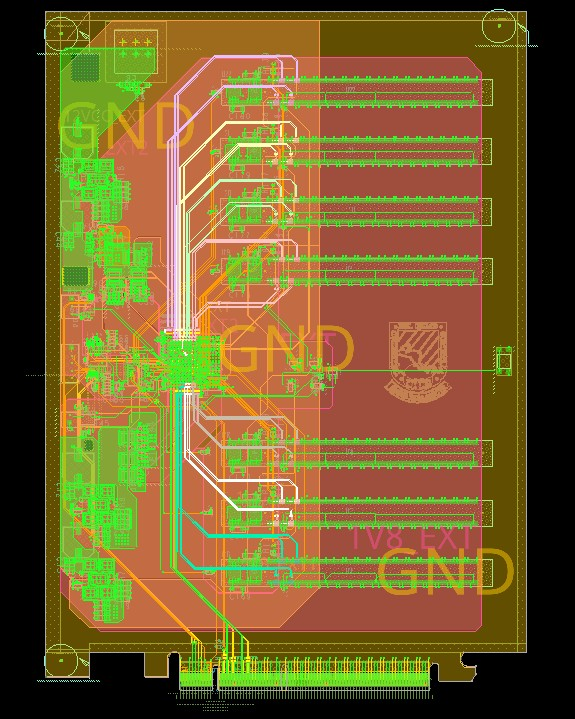
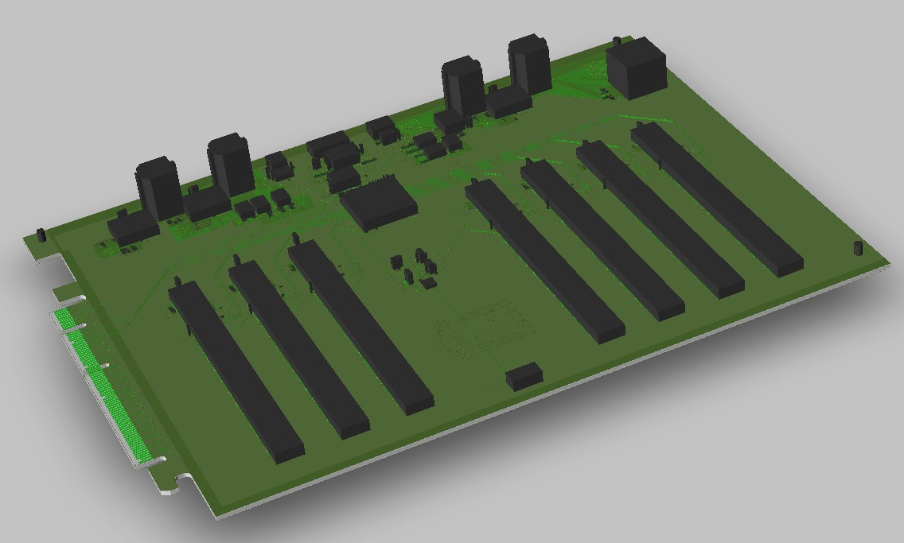
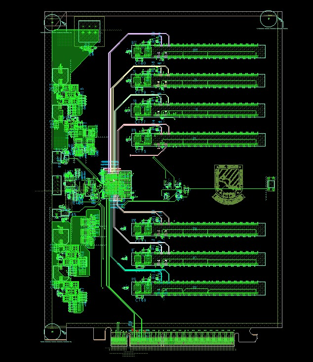
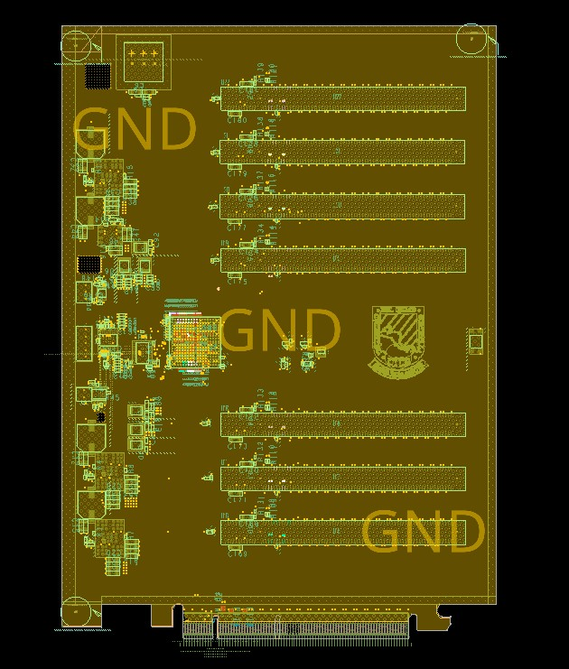
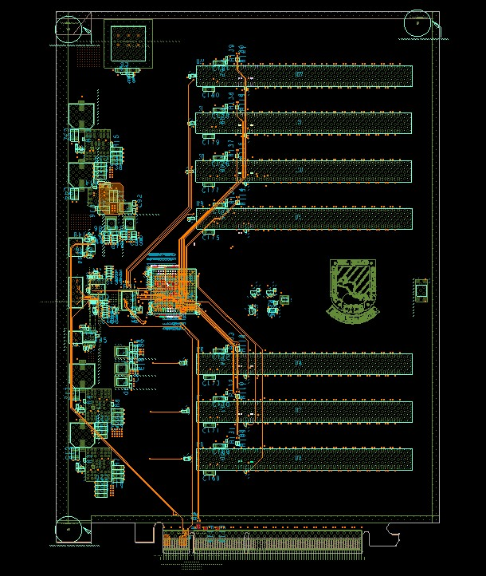
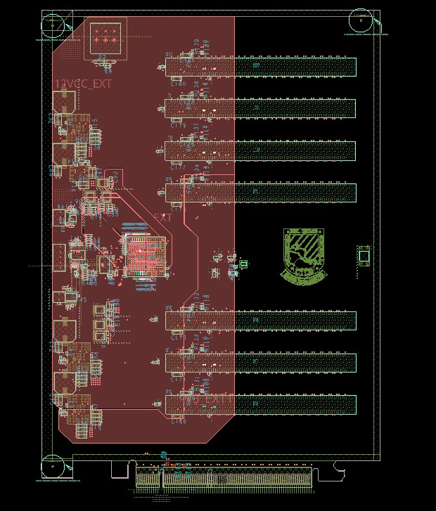
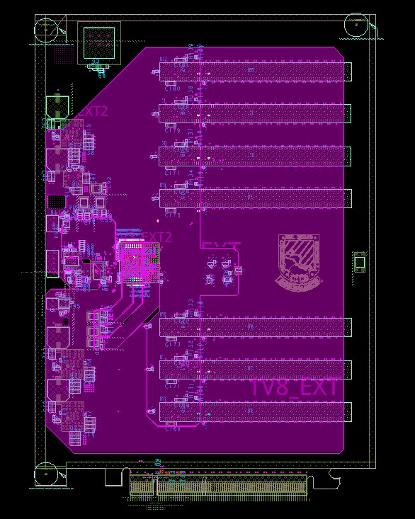
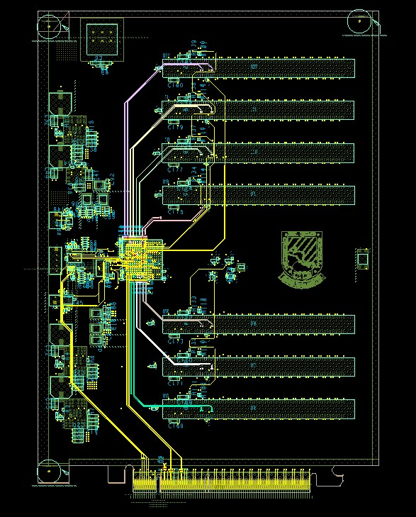
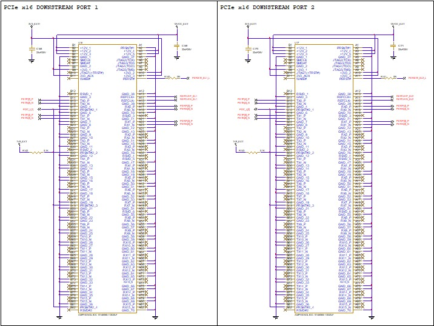

# PCIe Gen3 Switch Carrier Board
---

#### Electrónica 2 y Diseño Electrónico 1 - Kevin González - Universidad del Istmo de Guatemala

---



---



---

## Descripción General

Este proyecto consiste en el diseño completo de una tarjeta de expansión PCI Express basada en un switch PCIe Gen3 y desarrollada tomando como referencia la EVB (Evaluation Board) oficial del fabricante Diodes Incorporated.

El objetivo principal del proyecto fue desarrollar una plataforma personalizada de expansión PCIe con:

- Puertos PCIe downstream mediante conectores PCIe x16 físicos
- Soporte para tarjetas PCIe x4
- Routing PCIe Gen3 de alta velocidad
- Diseño optimizado para manufactura
- PCB multicapa con control de impedancia

Todo el diseño fue realizado en Cadence Allegro / OrCAD siguiendo las recomendaciones del layout guide oficial PCIe.

---

# Características Principales

## Arquitectura PCIe

- 1 puerto PCIe Upstream
- 7 puertos PCIe Downstream
- Conectores PCIe x16 físicos
- Operación eléctrica x4
- Señales diferenciales PCIe Gen3
- REFCLK diferencial de 100 MHz

---

# Diseño del Hardware

## PCB

- PCB de 6 capas
- Espesor total aproximado: 1.6 mm
- Control de impedancia diferencial
- Routing High-Speed optimizado
- Planos dedicados de GND
- Compatible con ensamblado SMT

## Stackup

| Capa | Función |
|---|---|
| L1 | Señales High-Speed |
| L2 | Plano GND |
| L3 | Señales / Power |
| L4 | Señales / Power |
| L5 | Plano GND |
| L6 | Señales |

---

# Integridad de Señal

El diseño fue realizado considerando buenas prácticas de Signal Integrity para PCIe Gen3:

- Differential pair routing
- Length matching
- Control de skew
- Return paths continuos
- Minimización de stubs
- Necking controlado
- Impedance matching
- Referencia continua a GND

## Constraints utilizados

### PCIe TX/RX

- Impedancia diferencial: 85 Ω
- Matching intra-par
- Matching inter-par

### REFCLK

- Impedancia diferencial: 100 Ω
- Routing diferencial dedicado

---

# Diseño Mecánico

- Compatible con bracket PCIe full-height
- Soporte para ventilación activa
- Mounting holes para heatsink/fan
- Compatible con chasis estándar PCIe

---

# Herramientas Utilizadas

| Herramienta | Uso |
|---|---|
| OrCAD Capture CIS | Diseño esquemático |
| Cadence Allegro PCB Designer | Diseño PCB |
| Constraint Manager | Reglas de diseño |

---

# Capturas del Proyecto

---

## Top Layer



---


## GND 1 Layer



---

## Power 1 Layer



---

## Power 2 Layer



---

## GND 2 Layer



---

## Bottom Layer



---

## Dowstream Ports (schematic preview)



Vista de algunos dowstream ports del esquemático del sistema.

---

# Contenido del Repositorio

```text
/DRL
    Archivos de perforado (NC Drill)

/GERBER
    Archivos Gerber para fabricación

/BOM_PCIe_PCIe.BOM
    BOM exportado en formato texto

/BOM_PCIe_PCIe.BOM.xlsx
    BOM exportado en formato Excel

/PCIE-PCIE.DSN
    Proyecto esquemático de OrCAD Capture CIS

/pcie-pcie_3.brd
    Archivo PCB de Cadence Allegro

/Schematic.pdf
    Exportación PDF del esquemático completo

/DOCS
    Documentación adicional y otros archivos útiles

/Images
    Imagenes del repositorio
```

---

# Licencia

Este proyecto se comparte únicamente con fines educativos y de desarrollo.

